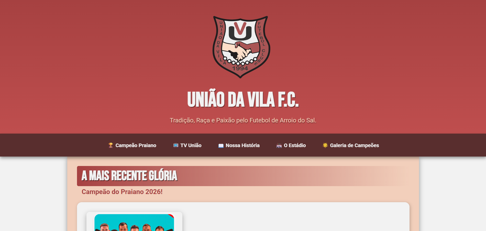
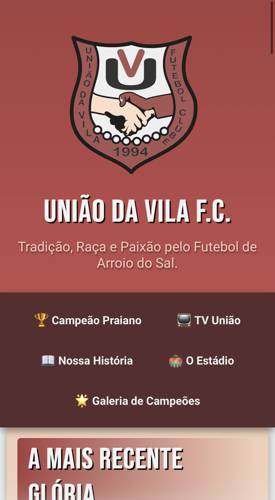

# 🔴⚽ União da Vila F.C. | Portal Oficial

> O portal digital para conectar a tradição e a paixão do União da Vila com seus torcedores, jogadores e toda a comunidade de Arroio do Sal.

## 📖 Sobre o Projeto
Este projeto foi desenvolvido para criar uma identidade digital profissional, imponente e moderna para o **União da Vila F.C.**, um tradicional clube de futebol amador. 

O site foi projetado para ser o coração da torcida na internet. A interface respira a identidade visual do clube (tons de vermelho e branco), proporcionando uma experiência imersiva onde qualquer pessoa pode mergulhar na rica história do time, relembrar elencos lendários e assistir aos jogos ao vivo.

Este projeto também marca a aplicação de conceitos modernos de Front-End, como estruturação semântica, alinhamentos complexos e responsividade total.

## 🚀 Acesse o Site (Live Demo)
🔗 **[Clique aqui para acessar o Portal do União da Vila no ar!](https://devlucasroldao.github.io/site-time-da-vila/)**

## ✨ Funcionalidades e Seções
A Landing Page funciona no formato *Single Page Application* (página única) com navegação suave (Smooth Scroll) entre as seções:

* **🏆 Campeão Praiano 2026:** Destaque visual imediato para a glória mais recente do clube, utilizando layout estilo pôster.
* **📺 TV União:** Integração direta com o YouTube via iframe responsivo para transmissão de jogos ao vivo, mantendo o torcedor dentro do site.
* **📖 Nossa História:** Sessão dedicada à fundação do clube e à homenagem ao nosso fundador, Seu Dorvalino.
* **🏟️ O Estádio:** Um passeio histórico sobre a conquista do nosso sagrado "caldeirão".
* **🐾 Mascote:** A origem do Zito, nosso símbolo de força na arquibancada, em um card de destaque exclusivo.
* **🌟 Galeria de Campeões:** Uma galeria em formato de *cards* com fotos e descrições das campanhas vitoriosas (1997, 1998 e 2009).

## 🛠️ Tecnologias e Técnicas Utilizadas
Para garantir um layout fluido e de alta performance, foram utilizadas as seguintes tecnologias e técnicas:

* **HTML5 Semântico:** Uso correto de tags como `<header>`, `<nav>`, `<main>`, `<section>`, `<article>` e `<aside>` para melhor SEO e acessibilidade.
* **CSS3 Moderno:** * **Flexbox:** Para alinhamentos lado a lado perfeitos e centralização de elementos.
  * **CSS Variables (`:root`):** Criação de uma paleta de cores centralizada para facilitar a manutenção.
  * **Media Queries (Mobile First):** O site é 100% responsivo, adaptando-se perfeitamente a telas de celulares, tablets e desktops.
  * **UI/UX:** Menu com posição `sticky` (fixo no topo), efeitos de transição/flutuação (hover) em imagens e botões, além de filtros como `drop-shadow` para destaque de logos.

## 📱 Capturas de Tela

  
  

---

Feito com muita dedicação e orgulho por **[Lucas Roldão](https://www.linkedin.com/in/devlucasroldao/)** 🚀
